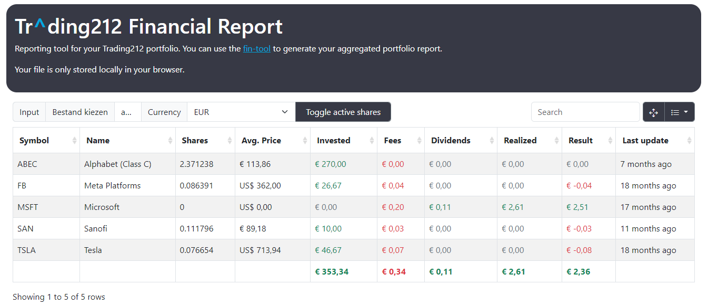

# fin

fin is a Trading212 CSV utility that aggregates your transaction CSV files into a couple of output formats.

You can generate an `aggregate` formatted JSON file that's used by the reporting tool,
or you can generate a `yahoo` formatted CSV file that can be imported into Yahoo Finance.

The tool deals with pies, stock splits and Yahoo ticker symbols. However, it's required by the user
to maintain these settings in the `config.yaml` file. After running the tool for the first time
a default `config.yaml` file will be generated for you.

**Note**

The goal of this tool is to give a big overview of your portfolio, along with fees and costs.
It combines all transactions and comes up with a final tally, as such it's not meant to help with taxes.
This also means that for the Yahoo format we don't show all lots, again, just the final tally.

**Beware**

Trading212 is under no obligation to keep their CSV format the same. History has proven that they
do change things from time to time, which either invalidates old CSVs or won't work with new.

We suggest to download new CSVs if you're experiencing problems. This can be done in 1-year increments.

## Usage

```bash
$ aggregator --help
Usage of aggregator.:
  -config string
        YAML file with configuration for this run
  -pie-only string
        Only output specific pie output
  -skip-pies
        Skip pie separation during output
```

Most of the settings are actually configured in `config.yaml`. The flags allow you to override some specific settings.

### Config

```yaml
---
# Required config
input: data # folder where your Trading212 CSVs are stored
output: aggregated_quotes # name of output file (prefix)
format: aggregate # aggregate or yahoo

# Optional config
skip-pies: true # skip splitting by pies (default: false)
pie-only: "" # only generate this pie (default: "")

# Splits is a list of split events relevant to your portfolio
# this is needed to calculate the total stock count
splits:
  - symbol: ABEC
    date: 2022-07-16
    ratio: 20 # for reverse splits, use a decimal ratio

# Symbols is a list of conversions to take Trading212 symbols
# and convert them to the symbols used by Yahoo portfolios
symbols:
  RIO: RIO.L
  SAN: SAN.PA

# Renames deal with stocks that have changed their symbol
# for example by becoming a new company or by being delisted
renames:
  GPS: GAP
  TUP: TUPBQ
 
# Pies allows you split your aggregation into multiple CSVs
# uncomment to use
#pies:
#  - name: Growth
#    symbols:
#      - GOOG
#      - AMZN
#  - name: Dividend
#    symbols:
#      - PEP
#      - JNJ
```

## Reporting



The project has a reporting tool that can be used to generate a report of your portfolio.
It's also available at https://fin.gerben.dev as hosted by GitHub Pages.

It uses jQuery, Bootstrap and Bootstrap Table to generate the report. It has a local file mode using LocalStorage,
with the resources coming from a CDN. This means you can just open the `report/index.html` file in your browser
and it will work.

Remember to run the `aggregator` tool first to create your `aggregated_quotes.json` file. You can also
use the `agg.json` example output file in this repo to test the reporting tool.

The default currency is set to EUR, but you can use the dropdown to change it to GBP or USD.


## Changelog

- v0.2.7 - 2024-10-15 - Handle events related to T212 Card + Withdrawals
- v0.2.6 - 2024-10-05 - Added "Renames" config for renamed/delisted stocks
- v0.2.5 - 2024-02-08 - Added "Lending interest" field
- v0.2.4 - 2023-08-01 - Fix stock splits for stocks that are untouched + Update dependencies
- v0.2.3 - 2023-07-31 - Skip "Currency conversion" action + Deposits has changed fields
- v0.2.2 - 2023-07-24 - Currency name not in headers anymore
- v0.2.0 - 2023-06-06 - Added "Interest On Cash" field